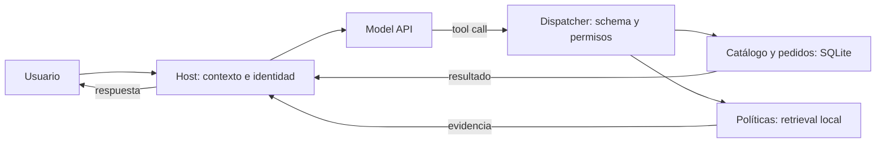

# Arquitectura · Carrito

Una aplicación pequeña para distinguir qué decide el modelo y qué controla el software. Cada componente tiene una responsabilidad explícita.

El mismo catálogo se puede exponer mediante el MCP server de demostración. No cambia quién decide llamar a la tool ni quién aplica permisos.

## Cuatro tools

| Tool | Entrada elegida por el modelo | Resultado / efecto |
|---|---|---|
| `search_products` | query, presupuesto opcional en EUR | Productos locales, precio en céntimos |
| `get_order` | order ID | Pedido del usuario activo o error sin datos ajenos |
| `search_policies` | query | Documentos cortos con source IDs |
| `request_return` | order ID y motivo | Propuesta pendiente o solicitud registrada tras confirmar |

`StoreTools` recibe la identidad desde el host. Los argumentos de una tool no pueden redefinirla. El dispatcher valida nombres y argumentos. El modelo no ejecuta Python arbitrario.

## Confirmar una solicitud

1. La tool comprueba propiedad del pedido y condiciones de la tienda ficticia.
2. Si falta confirmación, prepara el pedido y motivo concretos; no escribe una solicitud.
3. El host muestra ese contenido y recoge una confirmación explícita con `confirm_pending()`.
4. La operación confirmada registra una solicitud. Si cambian pedido o motivo, se necesita otra confirmación.
5. Repetir la solicitud registrada devuelve su resultado sin crear una segunda.

Esta confirmación del usuario no representa una autorización administrativa para reembolsar. El taller no incluye dinero real, pagos ni cancelaciones. Las políticas sintéticas enseñan contratos de aplicación; no constituyen asesoramiento sobre derechos del consumidor.

## Contexto, estado y observabilidad

El historial contiene mensajes e items de respuesta de la API, incluidos los que hacen falta para continuar llamadas con tools. Las observations se asocian a su `call_id`. Al usar `store=False`, el adaptador solicita y conserva `reasoning.encrypted_content` para continuar con modelos de razonamiento sin estado en el servidor; es un campo opaco, no texto para interpretar. [Referencia oficial](https://developers.openai.com/api/docs/guides/reasoning). El loop termina por respuesta, aclaración o límite; los errores del modelo se hacen visibles.

SQLite almacena productos, pedidos y solicitudes. Historial y confirmación pendiente pertenecen a la sesión. No hay memoria entre usuarios ni checkpoint durable del agent loop. El notebook comienza con datos preparados en memoria; una base con archivo permite mostrar persistencia de los efectos.

Las trazas JSONL contienen llamadas, argumentos, resultados, usage, tiempos y motivo de salida. La demo permite leerlas sin desplegar una plataforma de observabilidad. Las fixtures están etiquetadas y su usage no se presenta como consumo real de un modelo.

## Progresión y decisiones

- S1: llamada y respuesta; cinco casos observados manualmente.
- S2: contexto, salida estructurada y validación de hechos.
- S3: retrieval medido en cuatro condiciones, tool roundtrip, MCP ejecutado y comparación LangChain.
- S4: perfil del loop real, fallos controlados, recuperación explícita de preferencias y confirmación.
- S5: perfil propio y Skills, diagnóstico, mejora del contrato, regresiones y revisión humana.

La selección lexical de seis documentos cortos es deliberadamente sencilla. Embeddings y reranking se explican como alternativas, sin añadir otra infraestructura. LangGraph, agentes múltiples y memoria a largo plazo se reservan para problemas que necesiten esa complejidad.

[Evals](../evals/README.md) · [Código](../src/carrito/)

## Comparación de S3 y límites de producción

`carrito.langchain_demo` reutiliza las funciones de retrieval y catálogo mediante `StructuredTool`, `bind_tools`, `AIMessage` y `ToolMessage`. Es un workflow de lectura con dos llamadas como máximo; el agente principal continúa usando el loop Python y la API nativa. El extra `langchain` es opcional. [Código y guía de comparación](../examples/langchain-comparison.md).

Al detenerse por presupuesto de tools o tokens, el loop devuelve un resultado de error para cada llamada pendiente, sin ejecutarla. Así el siguiente turno conserva una continuación válida. Los tests también comprueban respuestas vacías, rechazos, outputs incompletos y errores de almacenamiento/modelo.

Esta arquitectura es una aplicación local de aprendizaje. Para publicar un servicio real habría que definir autenticación del host, persistencia concurrente, control del historial, retención de trazas, límites/coste, recuperación de fallos y revisión humana de calidad. S5 enseña a identificar esas decisiones y a justificar una mejora con evidencia; no despliega un servicio de producción ni certifica su fiabilidad.

## Configuración compartida por los notebooks

`carrito.context` contiene `ConversationState`, `compose_context` y `RecommendationContract`. `carrito.lab.run_profile` los utiliza para construir el request que recibe `run_agent`. `AgentProfile` define objetivo, tools permitidas y límites; el host bloquea llamadas fuera del perfil aunque el modelo las emita.

`StoreTools(..., policy_retriever=...)` recibe la estrategia de retrieval estudiada en S3. El notebook inyecta `partial(retrieve, chunks=load_chunks(), top_k=2, expand=True)` y ejecuta esa misma tool dentro del agente. El constructor de respuesta de S5 se aplica a los resultados observados, conservando `model_answer` y respuesta final separados.

`save_state`/`load_state` recuperan preferencias tipadas. No conservan un agent loop ni sus aprobaciones. `recover_read` reintenta únicamente una lectura marcada como transitoria. Las métricas distinguen tiempos de modelo, tools y run; con fixtures no son un benchmark de inferencia.

[Guía de experimentos, APIs y resultados](../examples/learning-labs.md).
